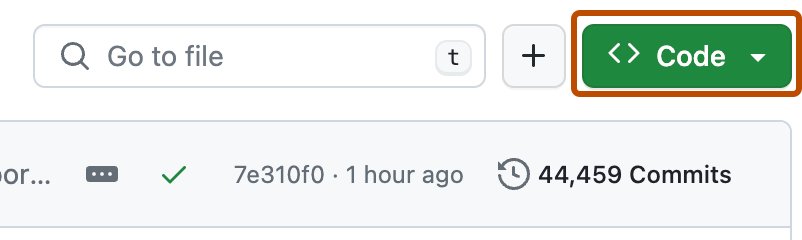

# 🚀 Hiyas System - Local Setup Guide

Welcome! This guide will walk you through setting up the **Hiyas System** on your local machine using XAMPP. Follow each step carefully and you'll have it running in no time.


---

## 🛠️ Step-by-Step Setup

### 🔹 Step 1: Download XAMPP

Download and install XAMPP from the official website:  
👉 [https://www.apachefriends.org/download.html](https://www.apachefriends.org/download.html)

During installation, ensure that **Apache** is selected as a component.

---

### 🔹 Step 2: Download the Repository ZIP

Download this GitHub repository as a ZIP file.

1. Click the green **"Code"** button at the top of this page.
2. Then click **"Download ZIP"**.



---

### 🔹 Step 3: Extract Files to XAMPP Directory

1. Open your Downloads folder.
2. Right-click the ZIP file and choose **"Extract All..."**
3. Extract the contents to:  
   `C:\xampp\htdocs\`

4. After extracting, rename the folder from:  
   `hiyas-system-main` → `hiyas-system`

---

### 🔹 Step 4: Update the Main `index.php` File

1. Go to:  
   `C:\xampp\htdocs\`
   
2. Open the existing `index.php` file in a code editor like Notepad or VS Code.

   _Note: There are two index.php files — make sure to edit the one in the htdocs folder._

3. Replace **all its contents** with the following:

   ```php
   <?php
       header('location: ./hiyas-system/');
   ?>
   ```


---

### 🔹 Step 5: Start Apache in XAMPP

1. Open the **XAMPP Control Panel**
2. Click **Start** next to **Apache**

You should see the Apache module turn green.

---

### 🔹 Step 6: Open Hiyas System in Your Browser

1. Open your preferred browser
2. Type `localhost` in the address bar and hit Enter

🎉 If everything is set up correctly, you should now see the **Hiyas System** Login page!

---

## 🧩 Troubleshooting

If the system doesn't appear:

- ✅ Is Apache running in XAMPP?
- ✅ Is your folder named exactly `hiyas-system`?
- ✅ Did you place the project inside `htdocs`?
- ✅ Did you update the correct `index.php`?

---

## 🙌 You're Done!

Welcome aboard! You now have the Hiyas System running locally on your machine.

